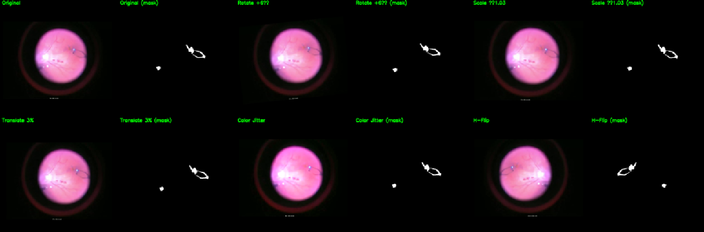
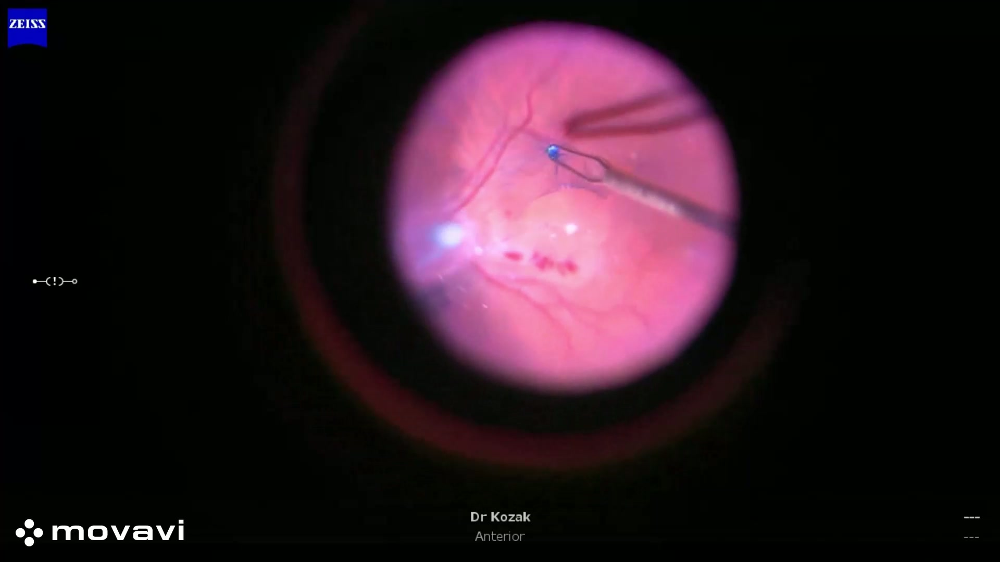
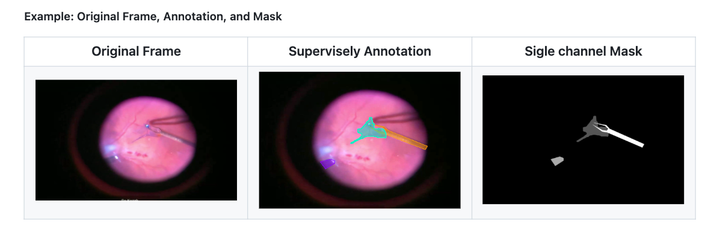

# Epiretinal Membrane (ERM) & Instrument Segmentation in Intraoperative Retinal Surgery Video

**Author:** Saurav Verma, M.S. Information Science, University Of Arizona
**Advisor:** Dr. Eungjoo Lee  
**Lab:** Vision, Systems & Intelligence (VSI) Lab — University of Arizona  

> ⚠️ **Research & Code Availability Notice (VSI Lab)**  
> This project is part of ongoing research in the Vision, Systems & Intelligence (VSI) Lab.  
> - Source **code**, detailed configuration files, and **raw data** (surgical videos, full masks, metadata) **cannot be shared** in this public repository.  
> - Certain methodological details and dataset specifics are intentionally described only at a **high level**.  
> - This repo therefore focuses on **documentation, figures, and a clear description of the research workflow and my individual contributions**, rather than a fully reproducible release.

> **Note:** This repository currently contains **documentation and figures only**.  
> It is intended to satisfy the capstone GitHub documentation requirement and to communicate work done for the ERM project.

---

## 1. Project Overview

Epiretinal membrane (ERM) peeling in vitreoretinal surgery depends on accurately identifying **thin, low-contrast membranes** and instrument–tissue interactions in intraoperative microscope video.

While pixel-level segmentation is widely studied in **abdominal and robotic surgery**, ophthalmic surgical video remains **underrepresented**. This project builds a **small pilot benchmark** for **ERM + instrument segmentation** in intraoperative retinal surgery videos and evaluates modern segmentation models under:

- **Extreme foreground sparsity:**  
  Less than **1% of pixels** contain ERM or surgical tools.
- **Challenging visual conditions:**  
  Faint/unstained ERM, tool overlap, illumination artifacts, shadows, and glare.

The work simultaneously:

- Serves as my **capstone project** for the M.S. Information Science (ML track), and  
- Contributes to an ongoing research stream in **computational ophthalmology** within the VSI Lab.

<div align="left">
  
</div>

**End-to-end ERM surgical segmentation workflow: from raw videos through preprocessing, annotation, model training, and evaluation.**


---

## 2. My Role & Contributions

Although this project is embedded in a broader VSI Lab effort, the following components represent **my direct, hands-on contributions**.


### 2.1 Dataset Curation & Design

- Selected and sampled **300 frames at 1 fps** from **7 ERM surgeries**, focusing on:
  - Key phases: dye application, flap initiation, peeling progression, completion.  
  - Inclusion of **challenging frames** (faint/unstained ERM, overlapping tools, strong illumination, shadows).  
- Computed per-surgery and global stats:
  - Frequency of ERM presence  
  - Instrument presence  
  - Phase distribution across frames  
- Defined and enforced **surgery-level Train/Val/Test splits** to prevent patient leakage:
  - Train: 231 frames  
  - Val: 21 frames  
  - Test: 48 frames  

### 2.2 Annotation Workflow & Support

- Set up **Supervisely projects**, class definitions, and color schemes for:
  - `ERM`  
  - `Retinal forceps`  
  - `Endoillumination / light tool`  
- Designed a **tag schema** for surgical phases:
  - Dye, flap initiation, peeling, completion  
- Generated **annotator preview panels**:
  - CLAHE and contrast-enhanced images  
  - Edge/gradient-emphasized variants  
  - Channel-split and ratio views  
- Worked with student annotators and clinicians to:
  - Clarify what counts as ERM under traction  
  - Standardize labeling behaviour around forceps tips and peel fronts.

### 2.3 Preprocessing & Pipeline Implementation

- Implemented a modular pipeline (e.g., `pipeline.py` style orchestration) to:

  1. **Frame extraction**  
     - Use `ffmpeg` to extract frames from raw surgical videos at 1 fps.

  2. **Quality filtering**  
     - **SSIM-based de-duplication** to remove near-identical frames.  
     - **Variance-of-Laplacian blur scoring** to drop heavily blurred frames.

  3. **ROI cropping & resizing**  
     - Defined case-specific **fixed ROIs** to isolate the circular surgical field.  
     - Performed joint resizing of images + masks to **512×512** and **768×768**.

  4. **Mask preparation**  
     - Imported Supervisely exports (JSON + color masks).  
     - Standardized multi-class mask encoding.  
     - Added support for optional **binary masks** where needed.

  5. **Augmentation previews**  
     - Produced grid-style augmentation panels (original + multiple transformed variants) to sanity-check augmentation settings.

### 2.4 Model Training & Evaluation Setup

- Implemented configuration-driven training for:

  - **DeepLabv3+** (ResNet-101 backbone)  
  - **UNet++** (ResNet-101 backbone)  

- Set up **composite loss**:
  - Primary: **Dice loss + Cross-Entropy loss**  
  - Experimental: **low-weight Tversky loss** (e.g., α=0.3, β=0.7, λ≈0.1) to bias towards recall on thin ERM regions.  
  - Observed that Tversky did **not** consistently improve performance on this small dataset, so **reported results** use Dice + CE only.

- Implemented a rich **evaluation script** computing:

  - **Present-only Dice** per class (only on frames where that class is present).  
  - **overall mean Dice / IoU** (dataset-level) with foreground mean mDice/mIoU.  
  - **Boundary-F1 @ 3 px** for ERM and instruments.  
  - **Pixel-share analysis**:
    - Mean and std of class-wise pixel fractions for ground truth vs predictions.  
    - Background pixel share and foreground sparsity checks.  
  - Optional **false-positive rate measures** on class-absent frames (using a pixel threshold).

### 2.5 Experimentation & Analysis

- Compared **512×512 vs 768×768** training resolutions and analyzed:

  - Why 512×512 gave better performance under this dataset size and sparsity.  
  - How thin ERM contour quality degraded at 768×768 (harder optimization, more background, same number of ERM pixels).  

- Performed **class-wise analysis**:

  - ERM vs forceps vs light tool performance.  
  - Behaviour on typical vs challenging frames.

- Drafted:

  - An **ARVO-style abstract** describing the dataset and results.  
  - Internal documentation summarizing experiments, limitations, and next steps.

### 2.6 Visualization & Communication

- Created **qualitative panels** for:

  - A typical surgical frame with forceps initiating an ERM peel.  
  - Annotated overlays (colored + grayscale mask).  
  - Good prediction vs challenging prediction examples.  
  - Augmentation grids.

- Designed the **4′×4′ iShowcase poster** including:

  - Clinical context  
  - Dataset & pipeline overview  
  - Key metrics  
  - Qualitative results  
  - Limitations and high-level future directions.

---

## 3. Background, Literature Context & Novelty

### 3.1 Background

Surgical video segmentation is an active research area, especially in **laparoscopic and robotic surgery**, with applications such as:

- Instrument detection and tracking  
- Tissue / organ segmentation  
- Surgical workflow and phase recognition  

Key challenges in surgical video include:

- Dynamic lighting, reflections, and motion blur  
- Occlusions by instruments  
- Subtle texture and contrast differences  
- Limited availability of high-quality, pixel-wise annotated datasets  

Most established benchmarks (e.g., **Cholec80**, **EndoVis**, **CholecTrack20**) focus on **laparoscopic abdominal surgery**.

In ophthalmology, most ML work targets:

- **Fundus photographs** (e.g., DR grading, vascular changes, CKD risk)  
- **OCT scans** (e.g., layer segmentation, fluid detection, ERM detection)  

In contrast, **intraoperative microscope video** from retinal surgery is much less explored, particularly for **frame-wise, pixel-level ERM segmentation**.

---

### 3.2 Gaps in Current Research

- **Pixel-level segmentation of subtle, transparent ERM** on surgical video is **rarely addressed**.  
- Ophthalmology datasets primarily cover **fundus/OCT**, not **vitreoretinal surgery video**.  
- Public surgical video datasets do **not** include ERM/ILM peeling despite covering tools, organs, and phases.  
- Existing ERM literature often focuses on:
  - OCT-based detection or grading  
  - Post-operative outcomes  
  - Augmented visualization / feature tracking  
  rather than **direct pixel masks of the membrane during surgery**.

---

### 3.3 What This Project Adds

To the best of our knowledge, this project is among the **first attempts at ERM membrane segmentation from intraoperative retinal surgery video**, with:

- A curated dataset of **300 frames (1 fps)** from **7 ERM peeling surgeries**, annotated with:
  - **ERM masks**
  - **Surgical instrument masks** (retinal forceps, light tool)
  - **Surgical phase labels** (dye application, flap initiation, peeling progression, completion) — collected but not yet used for modeling.
- A full **preprocessing and dataset-building pipeline**:
  - Frame extraction and de-duplication  
  - Blur and quality filtering  
  - Annotator-oriented image enhancements (CLAHE, edge emphasis, gamma, channel ratios)  
  - Fixed ROI cropping of the surgical field  
  - Joint resizing of images and masks to 512×512 and 768×768  
  - Surgery-level Train/Val/Test split
- An end-to-end **training + evaluation framework** with:
  - DeepLabv3+ and UNet++ backbones  
  - Dice + Cross-Entropy loss, with an optional low-weight Tversky term explored  
  - Metrics specifically tailored for thin, sparse structures:
    - Present-only Dice
    - Boundary-F1 (3-px tolerance)
    - Class-balanced mean Dice / IoU
    - Pixel-share consistency

---

### 3.4 Novelty

- Most surgical video segmentation research emphasizes **abdominal / robotic** procedures; **ERM segmentation from retinal surgery video** is **largely unexplored**.  
- This project establishes a **benchmark-style framework** for:
  - Joint ERM + instrument segmentation,  
  - With realistic challenges: faint/unstained membrane, tool overlap, variable illumination, and <1% foreground pixels.  
- Focuses on **micro-scale, transparent membranes**, where:
  - Small errors at the boundary can be clinically relevant, and  
  - Boundary-aware metrics become important.

---

### 3.5 Potential Impact

If extended and scaled within the VSI Lab, this line of work can support:

- **Quantitative evaluation** of retinal surgery outcomes (e.g., extent and completeness of ERM peel).  
- **Surgical workflow and phase recognition** in vitreoretinal surgery, using phase tags and segmentation together.  
- **Intraoperative decision support**, e.g., highlighting residual membrane or tool–tissue proximity.  
- **Education and simulation**, providing annotated video for training fellows and residents.

---

### 3.6 References (Selected)

#### Surgical Video Segmentation & Guidance

1. Twinanda, A. P. et al. (2016). *EndoNet: A Deep Architecture for Recognition Tasks on Laparoscopic Videos*. IEEE TPAMI.  
2. Allan, M. et al. (2019). *2017 Robotic Instrument Segmentation Challenge*.  
3. Bodenstedt, S. et al. (2018). *Comparative evaluation of instrument segmentation methods in minimally invasive surgery*. IEEE TMI.  
4. Chinedu et al. (2023). *CholecTrack20: A Dataset for Multi-Class Multiple Tool Tracking in Laparoscopic Surgery*.  
5. Rogeria et al. (2022). *Feature Tracking and Segmentation in Real Time via Deep Learning in Vitreoretinal Surgery: A Platform for Artificial Intelligence-Mediated Surgical Guidance*.  
6. Ming et al. (2024). *OphNet: A Large-Scale Video Benchmark for Ophthalmic Surgical Workflow Understanding*.

#### ERM / Ophthalmology / Retinal Imaging & CKD

7. Ayhan (Murat) et al. (2024). *Interpretable detection of epiretinal membrane from optical coherence tomography with deep neural networks*. Scientific Reports.  
8. David et al. (2025). *The Role of Artificial Intelligence in Epiretinal Membrane Care: A Scoping Review*. Ophthalmology Science.  
9. Carlà et al. (2025). *Smartphone Augmented En-Face Guided Epiretinal Membrane Peeling: A 3D Ngenuity Tool For Customized Treatment*. Retina.  
10. Run Zhou et al. (2025). *Intraoperative Augmented Reality for Vitreoretinal Surgery Using Edge Computing.*  
11. Onur et al. (2025). *Automated Detection of Retinal Detachment Using Deep Learning-Based Segmentation on Ocular Ultrasonography Images*.  
12. Charumathi et al. (2020). *A deep learning algorithm to detect chronic kidney disease from retinal photographs in community-based populations*.  
13. Guanrong et al. (2024). *Association of retinal age gap with chronic kidney disease and subsequent cardiovascular disease sequelae*.  
14. Bjorn et al. (2023). *Deep learning algorithms to detect diabetic kidney disease from retinal photographs in multiethnic populations with diabetes*.  
15. Youngmin et al. (2025). *Diagnosis of Chronic Kidney Disease Using Retinal Imaging and Urine Dipstick Data: Multimodal Deep Learning Approach*.  
16. Yuhe et al. (2024). *Performance of deep learning for detection of chronic kidney disease from retinal fundus photographs: A systematic review and meta-analysis*.

*(A more detailed discussion and additional citations are included in the capstone report and internal VSI materials.)*


---

## 4. Dataset & Annotation Summary (High Level)

> **All data remain on secure VSI lab storage and are not distributed via this repository.**  


- **Source:**  
  7 vitreoretinal surgeries involving ERM peeling, recorded via intraoperative microscope video.

- **Sampling:**  
  300 frames total, sampled at **1 fps**, favouring regions around:

  - Dye application  
  - Flap initiation  
  - Peeling progression  
  - Completion

- **Annotation platform:**  
  **Supervisely** (pixel-wise segmentation).

- **Segmentation classes:**

  - `ERM` – thin, partially transparent membrane under traction.  
  - `Retinal forceps` – intraocular retinal forceps.  
  - `Light tool` – endoillumination / light pipe.

- **Surgical phase tags (not modeled yet):**

  - Dye application  
  - Flap initiation  
  - Peeling progression  
  - Completion

- **Key annotation challenges:**

  - Faint / unstained ERM that can be almost indistinguishable from the underlying retina.  
  - Instrument overlap and tool shadows obscuring membrane edges.  
  - Illumination variations and glare.  
  - Very small ERM regions occupying **<< 1%** of frame area.

---

## 5. Preprocessing & Pipeline

The pipeline is implemented as a sequence of reproducible steps (configured via internal YAML/JSON config files):

1. **Frame Extraction & Selection**
   - `ffmpeg`-based extraction at **1 fps** from raw surgery videos.
   - Removal of near-duplicate frames using **SSIM-based similarity**.

2. **Quality Filtering & Enhancements**
   - **Variance-of-Laplacian blur scoring** to drop heavily blurred frames.  
   - Generation of annotator-friendly previews:
     - CLAHE  
     - Edge-enhanced views  
     - Gamma adjustments  
     - Channel splits / ratio views

3. **ROI Cropping & Resizing**
   - Case-specific **fixed ROI** to isolate the circular surgical field.  
   - Joint resizing of images + masks to:
     - **512×512 px** (primary)  
     - **768×768 px** (exploratory)

4. **Mask Preparation**
   - Import Supervisely project exports.  
   - Convert color masks to integer-labeled multi-class masks.  
   - Support for binary masks (e.g., ERM-only) where necessary.

5. **Train/Val/Test Split**
   - **By surgery**, not by frame (to prevent patient leakage):  
     - Train: 231 frames  
     - Val: 21 frames  
     - Test: 48 frames  

6. **Training-ready Dataset**
   - Normalized tensors in **CHW** format.  
   - Ready to be consumed by PyTorch `DataLoader`.

A simplified textual view of the pipeline:

```text
Raw ERM Surgery Videos
        │
        ▼
Frame Extraction → Deduplication → Blur/Quality Checks
        │
        ▼
Annotator Enhancements (CLAHE, edges, channel splits)
        │
        ▼
Supervisely Annotations (ERM + Instruments + Phase tags)
        │
        ▼
ROI Crop + Resize (512 / 768) + Splits by Surgery
        │
        ▼
DeepLabv3+ / UNet++ Training & Evaluation
        │
        ▼
Metrics + Qualitative Panels (good & challenging cases)

```
## 6. Models & Training Setup

> **Implementation code for models and training loops is kept internal to the lab.**  
> This section documents the conceptual setup and configurations.

### 6.1 Architectures

- **DeepLabv3+**
  - Encoder: ResNet-101 (ImageNet-initialized)
  - Decoder: atrous spatial pyramid pooling (ASPP) + decoder head

- **UNet++**
  - Encoder: ResNet-101 (ImageNet-initialized)
  - Decoder: nested skip connections with dense connectivity

### 6.2 Input Resolutions

- **512×512 px**
  - Primary resolution
  - Best empirical trade-off between context and contour quality

- **768×768 px**
  - Exploratory high-resolution setting, which underperformed on this pilot dataset due to:
    - Limited training data
    - \< 1% foreground pixels
    - Optimization difficulty for thin contours at higher spatial resolution

### 6.3 Loss Functions

- **Primary training loss**
  - Composite: **Dice loss + Cross-Entropy (CE) loss** (multi-class)

- **Experimental extension**
  - Optional **Tversky loss** with parameters (α = 0.3, β = 0.7, λ ≈ 0.1) to emphasize recall (penalize false negatives) on thin ERM regions
  - On this small dataset, the Tversky term did **not** consistently improve metrics; for clarity, **reported results use Dice + CE** only

### 6.4 Optimization & Augmentation (High Level)

- **Optimizer:** AdamW  
- **Epochs:** ~80 (pilot runs)  
- **Augmentations (train only):**
  - Horizontal flips
  - Small rotations and translations
  - Brightness/contrast/gamma adjustments
  - Mild blur / despeckle variants



*Training augmentations: rotation, flips, color jitter, scaling. Top-left: original + mask; other tiles: augmented variants.*

---

## 7. Evaluation & Results (Summarized)

Exact metric tables are retained in internal VSI lab logs; here we summarize the main findings.

### 7.1 Metrics

The evaluation script reports:

- **Present-only Dice (per class)**
  - Soft Dice computed only on frames where the class is present in ground truth
  - Main quality metric for ERM, forceps, and light tool

- **mmseg-style Dice / IoU (dataset-level)**
  - Aggregated TP/FP/FN across the entire dataset
  - Per-class Dice and IoU
  - Foreground mean mDice / mIoU across ERM, forceps, and light tool

- **Boundary-F1 @ 3 px**
  - F1 score of boundaries with a 3-pixel tolerance
  - Captures contour quality for thin membranes

- **Pixel-share analysis**
  - Mean ± std of GT vs prediction pixel fractions per class
  - Background fraction; confirms \< 1% foreground and helps detect bias toward over- or under-segmentation

### 7.2 Headline Results

**DeepLabv3+ @ 512×512 (best-performing configuration)**

- Present-only Dice (approximate):
  - ERM: ~0.77
  - Forceps: ~0.83
  - Light tool: ~0.76
- ERM Boundary-F1 @ 3 px: ~0.78
- Foreground mean mDice / mIoU: ~0.74 / 0.59
- ERM pixel share:
  - Prediction vs GT ≈ **0.159% vs 0.157%**, indicating that the model recovered membrane proportion reasonably well despite \< 1% foreground pixels

**UNet++ @ 512×512**

- Slightly lower ERM Dice (~0.70) and similar instrument performance
- Foreground mean mDice / mIoU ≈ **0.71 / 0.56**

**DeepLabv3+ @ 768×768**

- Underperformed relative to 512×512:
  - Lower Dice / mIoU and weaker ERM boundary quality
- Likely causes:
  - Limited dataset size
  - Extreme foreground sparsity
  - Optimization challenges for thin membrane contours at higher resolution

### 7.3 Qualitative Observations

- On **well-visible, stained ERM**, predictions were:
  - Smooth, contiguous masks closely matching annotations

- On **faint or partially unstained membranes**:
  - Predictions were often fragmented or undersegmented

- **Instrument segmentation**:
  - Forceps and light tool segmentation was generally robust, with good localization across phases

---

## 8. Qualitative Examples & Figures

The repository is designed to include a small set of representative figures.




**Intraoperative frame showing forceps initiating an ERM peel.**

---



**ERM, retinal forceps, and light tool annotated in Supervisely.**

---


**Example segmentation result on a typical frame (ERM + instruments).**

---


**Challenging frame with faint ERM and tool overlap; partial undersegmentation is visible.**

---


**To aid clinical annotation, multiple enhanced visualizations are generated.**

---

## 9. Limitations & Lessons Learned

### 9.1 Limitations

- **Data scale**
  - Only **300 frames** from **7 surgeries**, with ERM present in a subset of frames.

- **Foreground sparsity**
  - ERM + instruments occupy **≪ 1%** of pixels, making the problem highly imbalanced.

- **Annotation difficulty**
  - Certain ERM regions remain ambiguous even with enhanced previews.
  - Small boundary differences can significantly affect Dice and Boundary-F1.

- **Generalization**
  - Results are **promising but not yet clinical-grade**.
  - More data, better coverage of staining conditions, and multi-center validation are needed.

- **Loss design**
  - Tversky was conceptually appealing for rare positives but did **not** provide consistent gains at this scale.

### 9.2 Lessons Learned

- **Resolution vs. data size**
  - Higher resolution (768×768) is **not automatically beneficial** when the dataset is small and the foreground is extremely sparse.

- **Boundary-focused metrics matter**
  - For thin structures like ERM, Boundary-F1 and qualitative contour inspection are as important as global Dice.

- **Annotation support is crucial**
  - Careful design of annotator aids (contrast enhancement, edge maps, etc.) can materially improve label quality.

---

## 10. Future Directions (Within Lab / Research Context)

Within the VSI Lab and the broader retina-AI collaboration, this pilot benchmark can be extended via:

- **Expanded dataset**
  - More surgeries, more diverse ERM appearances, and additional staining protocols.

- **Improved membrane annotations**
  - Iterative refinement with senior clinician review, particularly at peel fronts and forceps tips.

- **Advanced architectures**
  - Transformer-based segmentation architectures and multi-scale context models tailored to thin membranes.

- **Boundary-aware objectives**
  - Incorporate explicit boundary losses and uncertainty-aware segmentation for ERM edges.

- **Multi-task modeling**
  - Joint ERM + instrument segmentation and surgical-phase recognition using shared encoders.

- **Explainability & surgeon-facing interfaces**
  - Saliency or attention maps focusing on membrane regions.
  - Prototype overlays for education or potential intraoperative use.

---

## 11. Acknowledgments

I would like to thank:

- **Dr. Eungjoo Lee** – for guidance on project design, model selection, and evaluation strategy.  
- **Dr. Kozak and clinical collaborators** – for domain expertise, feedback on membrane identification, and clarifying what counts as ERM during peeling.  
- **Fellow students in the VSI Lab** – for annotation support, feedback on the pipeline, and helpful discussions.

---

## 12. Repository Contents (Public Version)

This GitHub repository is **documentation-oriented** and is intended for capstone submission and high-level project communication:

- `README.md`  
  - This document (overview, literature context, methods, results, and my contributions).
- `ERM_ishowcase_poster.pdf`  
  - 4′×4′ iShowcase poster summarizing the project for a general audience.
- `Capstone_Project_Pitch.pdf` 
  - Initial Project Pitch document at start of Capstone.
- `Capstone_Report.pdf` 
  - Capstone work report.
- `images/*`  
  - Representative images from the project

Additional implementation details and experiment logs are maintained in **internal VSI lab repositories and documents**, as this work is part of an ongoing research program.


